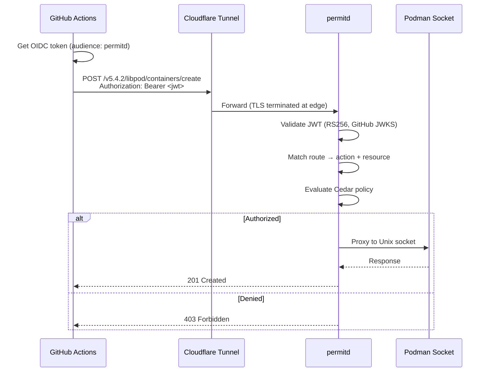
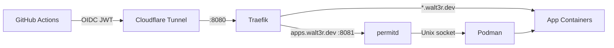

# permitd

OIDC Authorization Gateway for the Podman API, powered by [Cedar](https://www.cedarpolicy.com/).

permitd sits between GitHub Actions and a Podman socket, validating OIDC JWTs and evaluating fine-grained Cedar policies before proxying requests upstream. It enables secure, keyless CI/CD deployments without storing secrets.

## How It Works



## Architecture



## Features

- **Keyless auth** -- GitHub Actions OIDC tokens, no stored secrets
- **Fine-grained policies** -- Cedar attribute-based access control (repo, actor, resource)
- **Zero-copy proxy** -- Direct hyper-to-Unix-socket streaming
- **Route mapping** -- Configurable HTTP method + path pattern to Cedar action mapping
- **CLI tooling** -- `validate`, `check`, `routes`, `serve` subcommands
- **Structured logging** -- JSON or text format with tracing

## Quick Start

### Build

```bash
cargo build --release
```

### Configure

```toml
# config.toml
[server]
listen_addr = "0.0.0.0:8080"

[upstream]
socket_path = "/run/user/1000/podman/podman.sock"

[oidc]
issuer = "https://token.actions.githubusercontent.com"
audience = "permitd"
jwks_cache_ttl_secs = 3600

[cedar]
schema_path = "/path/to/schema.cedarschema"
policy_dir = "/path/to/policies/"

[routes]
mapping_file = "/path/to/routes.podman.toml"

[logging]
format = "text"
level = "info"
log_authorized = true
log_denied = true
```

### Write a Cedar Policy

```cedar
// Allow myorg/myapp workflows to deploy containers
permit (
    principal is Permitd::Workflow,
    action in [
        Permitd::Action::"containers:create",
        Permitd::Action::"containers:start",
        Permitd::Action::"containers:stop",
        Permitd::Action::"containers:remove",
        Permitd::Action::"images:pull"
    ],
    resource
)
when {
    principal.repository == "myorg/myapp" &&
    principal.actor == "deployer" &&
    resource.name like "myapp-*"
};
```

### Run

```bash
# Start the server
permitd serve --config config.toml

# Validate policies without starting
permitd validate --schema schema.cedarschema --policies ./policies/

# Dry-run an authorization check
permitd check --config config.toml \
  --principal myorg/myapp \
  --action containers:start \
  --resource mycontainer

# List route mappings
permitd routes --mapping routes.podman.toml
```

## Cedar Schema

permitd maps GitHub OIDC claims to Cedar entities:

### Principal: `Permitd::Workflow`

| Attribute | Source | Example |
|-----------|--------|---------|
| `repository` | OIDC `repository` | `waltervargas/pong` |
| `repository_owner` | OIDC `repository_owner` | `waltervargas` |
| `actor` | OIDC `actor` | `waltervargas` |
| `ref` | OIDC `ref` | `refs/heads/main` |
| `workflow_ref` | OIDC `job_workflow_ref` | `waltervargas/pong/.github/workflows/docker.yml@refs/heads/main` |
| `environment` | OIDC `environment` | `production` |
| `runner_environment` | OIDC `runner_environment` | `github-hosted` |

### Resources

| Entity | Attribute | Description |
|--------|-----------|-------------|
| `Container` | `name` | Container name or `*` for create |
| `Image` | `name` | Image reference (e.g., `ghcr.io/org/app:tag`) |
| `Volume` | `name` | Volume name |
| `Network` | `name` | Network name |

### Actions

| Category | Actions |
|----------|---------|
| Containers | `create`, `start`, `stop`, `remove`, `list`, `inspect`, `logs`, `exec` |
| Images | `pull`, `list`, `remove`, `build` |
| Volumes | `create`, `remove`, `list` |
| Networks | `create`, `remove`, `list` |

## Route Mapping

Routes map HTTP requests to Cedar actions and resources:

```toml
[[routes]]
method = "POST"
path_pattern = "/v{version}/libpod/containers/{id}/start"
action = "containers:start"
resource_type = "Container"
resource_from = "path:id"
```

Resource extraction modes:
- `path:id` -- Extract from URL path parameter
- `query:reference` -- Extract from query string
- `static:value` -- Use a fixed value
- `wildcard` -- Use `*` (any resource)

## GitHub Actions Integration

```yaml
deploy:
  runs-on: ubuntu-24.04-arm
  permissions:
    id-token: write  # Required for OIDC

  steps:
    - name: Get OIDC token
      id: oidc
      run: |
        TOKEN=$(curl -s -H "Authorization: bearer $ACTIONS_ID_TOKEN_REQUEST_TOKEN" \
          "$ACTIONS_ID_TOKEN_REQUEST_URL&audience=permitd" | jq -r '.value')
        echo "::add-mask::$TOKEN"
        echo "token=$TOKEN" >> "$GITHUB_OUTPUT"

    - name: Deploy container
      run: |
        curl -sSf -X POST \
          -H "Authorization: Bearer ${{ steps.oidc.outputs.token }}" \
          -H "Content-Type: application/json" \
          -d '{"name": "myapp", "image": "ghcr.io/org/app:latest"}' \
          "https://permitd.example.com/v5.4.2/libpod/containers/create"
```

## Policy Examples

**Read-only access for an org:**

```cedar
permit (
    principal is Permitd::Workflow,
    action in [
        Permitd::Action::"containers:list",
        Permitd::Action::"containers:inspect",
        Permitd::Action::"images:list"
    ],
    resource
)
when {
    principal.repository_owner == "myorg"
};
```

**Deploy scoped to specific repo, actor, and resources:**

```cedar
permit (
    principal is Permitd::Workflow,
    action == Permitd::Action::"images:pull",
    resource
)
when {
    principal.repository == "myorg/app" &&
    principal.actor == "deployer" &&
    resource.name like "ghcr.io/myorg/app:*"
};
```

## License

Apache-2.0
